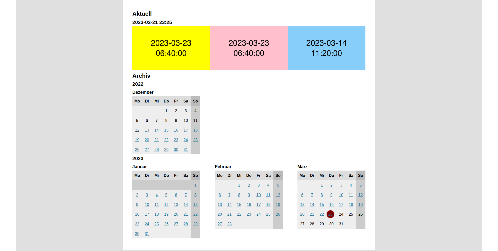

 # Reolink Cam Site

 Builds an overview webpage based on photos and videos created by [Reolink] security cameras.

 The application crawls through a directory tree hosting uploaded photos and videos, collects files
 that belong together, and creates a website with thumbnails linked with the video files. All video
 files remain in their existing location and are accessed via symlinks.

## Requirements

- A [Linux] server hosting the image and video data. Data is uploaded from Reolink cameras, for
  example using FTP transfer.
- Python 3 running this software, ideally scheduled automatically e.g. via [cron] job.
- Webserver able to deliver static webpage, e.g. [nginx].
- One ore more [Reolink] security cameras configured to upload photos and videos.
- Optional: to set up an FTP server: [docker].

### Example Directory Structure

The directory structure for a system with three cameras `camera-a`, `camera-b`, and `camera-c` with
pictures starting from 2022-11-15 looks like this:

```text
├── camera-a
│   ├── 2022
│   │   ├── 11
│   │   │   ├── 15
│   │   │   │   ├── camera-a_01_20221115233531.jpg
│   │   │   │   ├── camera-a_01_20221115233753.jpg
│   │   │   │   └── camera-a_01_20221115234516.jpg
│   │   │   ├── 16
│   │   │   │   ├── camera-a_01_20221116161531.jpg
│   │   │   │   └── camera-a_01_20221116161753.jpg
│   │   │   ├── 17
│   │   │   │   ├── camera-a_01_20221117085531.jpg
│   │   │   ┆   └── camera-a_01_20221117085753.jpg
┆   ┆   ┆   
│   │   └── 12
│   │       ├── 01
│   │       ┆   ├── camera-a_01_20221201061531.jpg
┆   ┆           ┆
│   └── 2023
│       ├── 01
│       ┆   ├── 01
┆           ┆
└── camera-b
    ├── 2022
    │   ├── 11
    │   ┆   ├── 15
    │       │   ├── camera-c_01_20221115233531.jpg
    │       ├── 16
    ┆       ┆
    └── 2023
```

## Usage

### Installation

The software supports `setuptools` installation via `pip` and the `pyproject.toml` configuration
file.

```console
$ pip install .
Processing /reolink-cam-site
  Installing build dependencies ... done
  Getting requirements to build wheel ... done
  Preparing metadata (pyproject.toml) ... done
Building wheels for collected packages: reolink-cam-site
Successfully built reolink-cam-site
Installing collected packages: reolink-cam-site
Successfully installed reolink-cam-site-0.1.0
$ prepare-cam-site 
usage: () --root ROOT --web-root WEB_ROOT --cameras [CAMERAS [CAMERAS ...]] [--date DATE] [-h]
(): error: the following arguments are required: --root, --web-root, --cameras
$ create-cam-site 
usage: create-cam-site --name NAME --dir DIR --cameras [CAMERAS [CAMERAS ...]] [--date DATE] [-h]
create-cam-site: error: the following arguments are required: --name, --dir, --cameras
```

After installation the software can be accessed via `prepare-cam-site` and `create-cam-site`.

### Preparation

First step to create a static cam site page. The script traverses the cameras directories in a
given root directory and creates links and thumbnails in the web root. The latter directory is used
as input for the [creation](#creation) script.

#### Usage

```console
prepare-cam-site \
        --root "/data/camera-storage" \
        --web-root ./out \
        --cameras camera-front camera-back \
        --date 2022-02-16
```

#### Parameters

- `root`: Root directory of cam data. The root directory containing sub directories for each
  camera. The camera directories contain data in the [Reolink] software format.
- `web-root`: The output directory. Will be used as output and expected to be the web root of the
  final cam site. This will contain the `images` and `thumbnails` directories after execution. The
  directory is supposed to be the input for the creation script.
- `cameras`: The cameras in the cam site. They are expected to be directories in the `ROOT`
  directory. They contain the content produced by [Reolink] software (in `year/month/day` sub
  directories). They are read and used to process the images and thumbnails.
- `date`: Load images for a certain date. The date is specified in ISO format `YYYY-MM-DD`.

### Creation

A static cam site page is created by `create_cam_site.py`. The script expects a prepared directory
with images and thumbnails as produced by the [preparation](#preparation) script.

#### Usage

```console
create-cam-site \
        --name "My CamSite" \
        --dir ./out \
        --cameras camera-front camera-back \
        --date 2022-02-16
```

#### Parameters

- `name`: The cam site name. Used as the title of the cam site in the created website.
- `dir`: The Output directory. Will contain the created cam site. Also used as input directory for
  `images` and `thumbnails`. This is the same output directory as used for the preparation script.
- `cameras`: A list of cameras in the cam site. The cameras are directories inside the `images` and
  `thumbnails` directories. They are the same as used as input for the [preparation](#preparation).
- `date`: Optional date to load images for. The date is specified in ISO format `YYYY-MM-DD`.

## Example

A cam site with three cameras can be generated by an [example script]. By default it generates a
file hierarchy as it would be created by Reolink cameras for three cameras. The fake pictures show
the timestamp. It generates pictures with a 10 minute interval for the most recent 100 days and
calls the scripts to generate the corresponding web site.

Details can be tweaked by adapting the following variables:
- `NAME`: the title of the start page
- `ROOT`: the root folder in which the fake images are created
- `WEB_ROOT`: the root folder for the web site (requires support for symlinks)
- `CAMERAS`: a list of camera names (no spaces allowed)
- `COLORS`: a list of [ImageMagick color names] (must have the same length as `CAMERAS`)
- `DAYS`: the number of most recent days for which pictures are generated
- `SKIP_SECONDS`: the interval between two pictures in seconds

The following picture shows the landing page generated by the [example script]:



## License

Copyright © 2022 Jan-Philipp Kappmeier

This project is [licensed](LICENSE) under the terms of the [Apache License 2.0].

[Reolink]: https://reolink.com/de/
[Linux]: https://www.linux.org/
[cron]: https://pubs.opengroup.org/onlinepubs/9699919799/utilities/crontab.html
[nginx]: https://www.nginx.com/
[docker]: https://www.docker.com/
[example script]: doc/create.sh
[ImageMagick color names]: https://imagemagick.org/script/color.php
[Apache License 2.0]: http://www.apache.org/licenses/LICENSE-2.0
